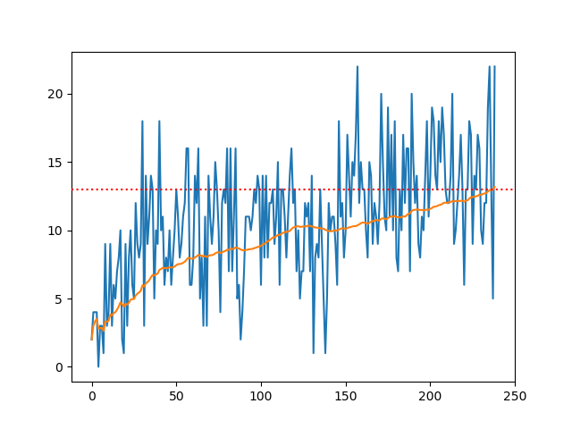

Navigation Project Report
=========================

This report describes my solution to the bananas environment provided by Udacity.  See the file README.md for a description of the environment.

Learning Algorithm
------------------

I solved the problem by implementing deep Q-learning.  My implementation is structured as a Python package with subpackages for various components of the learning algorithm.  I attempted to structure the package so that variations of the algorithm could be implemented easily.  In addition to the standard deep Q-learning algorithm, I implemented prioritized replay and double deep Q-learning.  

I found little difference in learning performance on the bananas environment among the different variations of the deep Q-learning algorithm during informal experimentation.  The most important hyper parameters seem to be the decay rate and final value of epsilon in the epsilon-greedy training policy.  If epsilon is above approximately 5% then the agent will not perform well enough to satisfactorily solve the environment even with a correct Q function.  However, the decay rate must be low enough to allow learning that Q function initially.  I used the `Adam` optimizer from `torch.optim` to optimize the neural network parameters.  I found, again in informal experimentation, that the learning rate of the optimizer impacted the speed of learning and that it was helpful to use the `torch.optim.lr_scheduler.ReduceLROnPlateau` scheduler to reduce the learning rate as training begins to plateau.

I used a densely connected feed-forward neural network architecture with two hidden layers with 75 nodes each.  I found 50 nodes to be inadequate, but 75 seems to be sufficient.  The layers are connected using a RELU activation function.  Dropout is also used, although I didn't perform sufficient experiments to determine whether it's actually beneficial.

In my final training script, I use the following hyper-parameters: 

epsilon start: 1.0
epsilon decay: .95
epsilon min: 0.005
batch size: 128
initial learning rate: 1e-3
dropout rate: 20%
prioritized replay a: 1.0
prioritized replay b start: 0.5
prioritized replay log b decay rate: .99
learning rate scheduler patience: 20
learning rate scheduler reduction rate: 0.1
double DQN: yes

Plot of Rewards
---------------

The parameters for my final fitted model are stored in the pickle file submission.pkl.  The following plot shows reward per episode as a function of training iterations.  It also shows average reward over the last 100 training episodes (or over all training episodes for episodes prior to the 100th).  In my final run, 239 episodes were required to achieve the solution objective.  However, my informal experiments indicated substantial variation in that number.

Ideas for Future Work
---------------------

More systematic experimentation could reveal the differences, if any, among the variation of the deep Q-learning algorithm that I implemented.  I could also implement dueling DQN to see whether there is any benefit for the bananas environment.  It might also be interesting to see whether a recurrent network with an internal state could have some advantage in this task, since it could possibly understand the environment more thoroughly.

